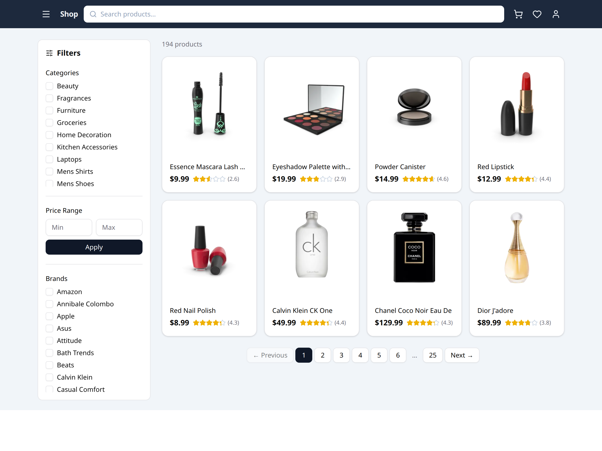
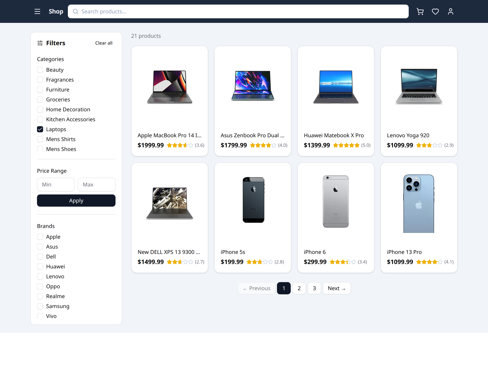
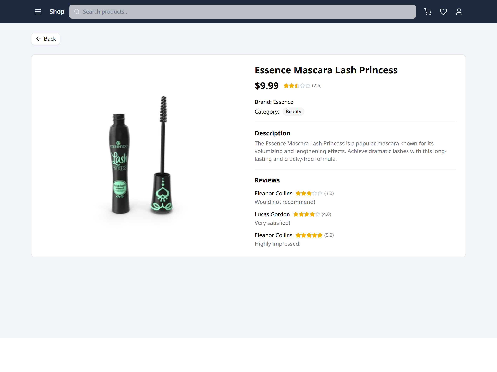

# Product Listing & Detail App

An Amazon-style e-commerce product listing application built with React, TypeScript
and the public [DummyJSON Products API](https://dummyjson.com/docs/products).

It has two screens:

- **Product Listing Page** (`/`) — filterable, paginated product grid with a filters sidebar.
- **Product Detail Page** (`/product/:id`) — full details, reviews and a filter-preserving Back button.

## Screenshots

### Product Listing Page



The default view: all **194 products** in a responsive card grid (image, title, price,
star rating). The left sidebar holds the filters — Categories (fetched from the API),
Price Range, and Brands. Numbered pagination with Previous/Next sits at the bottom and
collapses to an ellipsis (`1 2 3 4 5 6 … 25`) when there are many pages.

### Filters in action — multi-select categories



Here **Smartphones + Laptops** are both selected, so the grid shows the merged set
(**21 products**) and the product count updates. The Brands list automatically narrows to
only the brands present in the current selection. All filters combine, update the list
immediately, and reset pagination to page 1. Filter state lives in the URL
(`/?categories=smartphones,laptops`), so the view is shareable and survives navigation.

### Product Detail Page



Opened by clicking any card (`/product/:id`). Shows the product image, title, price,
rating, brand, category badge, full description, and customer reviews. The **Back** button
returns to the listing with the previously selected filters still applied.

## Tech Stack

| Concern        | Choice                                   |
| -------------- | ---------------------------------------- |
| Build tool     | Vite                                     |
| Language       | TypeScript                               |
| UI             | React 19 (functional components + hooks) |
| Styling        | Tailwind CSS v4                          |
| Components     | shadcn/ui (Radix primitives)             |
| Data fetching  | TanStack React Query + Axios             |
| Routing        | React Router                             |
| Icons          | lucide-react                             |

## Setup Instructions

Requires Node 18+ (developed on Node 24).

```bash
# install dependencies
npm install

# start the dev server (http://localhost:5173)
npm run dev

# type-check and build for production
npm run build

# preview the production build
npm run preview
```

No environment variables are needed — the public DummyJSON API requires no key.

## Features

### Product Listing Page
- Responsive product grid of cards (image, title, price, star rating).
- Filters sidebar:
  - **Category** — fetched dynamically from `/products/categories`; multi-select.
  - **Price range** — min/max inputs with an Apply button.
  - **Brand** — multi-select, built from the unique brands in the current scope.
  - **Search** — title search in the header.
- Filters combine, update the list immediately, and **reset pagination to page 1** on change.
- Numbered pagination with windowed page buttons and Previous/Next.
- Loading skeletons and an error state with retry.

### Product Detail Page
- Image, title, price, rating, description, brand, category and reviews.
- **Back** button returns to the listing with the **previously selected filters still applied**.

## Architectural Decisions

```
src/
├── components/
│   ├── common/      # StateMessage (shared error/empty block)
│   ├── layout/      # Header
│   ├── products/    # ProductCard, ProductGrid, FiltersSidebar, Pagination, Rating
│   └── ui/          # shadcn/ui primitives
├── hooks/           # use-products, use-categories, use-product, use-filter-params
├── lib/             # api (axios), queryClient, utils
├── pages/           # ProductListingPage, ProductDetailPage
└── types/           # Product / Category types
```

- **Filters live in the URL query string.** A single `useFilterParams` hook reads and
  writes `categories`, `minPrice`, `maxPrice`, `brands`, `q` and `page`. Storing state in
  the URL is what makes filters survive navigation to the detail page and back, and also
  makes a filtered view shareable. The detail page additionally receives the listing's
  query string via router state so its Back button restores the exact view.

- **Fetch-scope + client-side filtering.** DummyJSON cannot filter by price or brand
  server-side, so a fully server-driven approach would give inconsistent counts when
  filters combine. Instead the app fetches the full scope — all products
  (`/products?limit=0`), or, when categories are selected, the union of each selected
  category (`/products/category/{slug}` per category, merged and de-duplicated by id) —
  and applies price, brand and search filters and pagination on the client. The dataset
  is small (~200 items), so this keeps combined filtering correct and the brand list
  complete. Categories are **multi-select**: the dedicated category endpoint is still used,
  fanned out one request per selected category.

- **React Query** handles caching, loading and error states. Categories are treated as
  static (`staleTime: Infinity`); product scopes are cached for 5 minutes and reused when
  switching back to a previously viewed category. `placeholderData` keeps the old grid in
  place while a new category loads.

- **shadcn/ui over a heavy component library.** Components are copied into the repo
  (`components/ui`) rather than pulled from a runtime dependency, keeping the bundle lean
  while still giving accessible primitives. Styling stays mostly utility-class based.

## API Usage

| Endpoint                          | Used for                                  |
| --------------------------------- | ----------------------------------------- |
| `GET /products?limit=0`           | Full product scope (no category selected)    |
| `GET /products/categories`        | Category filter options                      |
| `GET /products/category/{slug}`   | Scope per selected category (fanned out, merged) |
| `GET /products/{id}`              | Product detail page                          |

## Assumptions Made

- Not every product in the dataset has a `brand`; the brand filter only lists brands that
  exist in the current scope and products without a brand are excluded when a brand is selected.
- Categories are multi-select; since the API only filters one category per request, the
  selected categories are fetched in parallel and merged (de-duplicated by id) client-side.
- Page size is fixed at 8 (a 4×2 grid on desktop) to match the reference design.
- Price inputs are committed via **Apply** (matching the design) rather than on every keystroke.

## Improvements If Given More Time

### Features
- Debounced search and a "no results" hint that clears the narrowest filter.
- Sorting (price, rating, name) and a price range slider.
- Cart / wishlist functionality behind the header icons.
- Image gallery on the detail page (the API returns multiple images).
- Skeleton-to-content fade and route transitions for polish.

### Testing
- Unit tests for `useFilterParams` (URL serialization) and the filtering logic.
- Component tests for the grid/filters and an E2E smoke test (Playwright) covering
  filter → navigate to detail → Back-restores-filters.

### Performance optimizations

What's already in place:
- **React Query caching** — `staleTime` (5 min for products, `Infinity` for categories)
  avoids refetching data that hasn't changed; revisiting a category or going Back to the
  listing serves instantly from cache instead of hitting the network.
- **`placeholderData`** keeps the previous grid visible while a new category loads, so the
  UI never flashes empty (avoids layout shift / CLS).
- **Memoized derivations** — brand extraction and the filter/pagination pipeline run inside
  `useMemo`, so typing in an unrelated input doesn't recompute the filtered list.
- **Client-side pagination** renders only 8 cards at a time rather than all ~200.
- **Lazy-loaded images** (`loading="lazy"`) defer off-screen product thumbnails.

What I'd add with more time:
- **Route-based code splitting** — `React.lazy` + `Suspense` for the detail page so its
  reviews/markup aren't in the initial bundle, shrinking first-load JS.
- **Virtualized grid** (`@tanstack/react-virtual`) if the page size grew large, to keep the
  DOM node count flat regardless of result count.
- **Server-driven pagination** — for a real backend that supports filtering, switch to
  `limit`/`skip` (or cursor) queries with React Query's `keepPreviousData`/infinite queries,
  so the client never holds the full dataset in memory.
- **Debounced + cancellable search** (`AbortController` via Axios) to cut wasted work and
  in-flight requests while typing.
- **Image optimization** — responsive `srcset`/`sizes`, explicit width/height to reserve
  space (zero CLS), and `fetchpriority="high"` on the detail hero image; blur-up placeholders.
- **Prefetch on hover** — `queryClient.prefetchQuery` for a product when its card is hovered,
  so the detail page is warm before the click.
- **Bundle trimming** — analyze with `rollup-plugin-visualizer`, tree-shake unused shadcn/Radix
  pieces, and self-host fonts to remove render-blocking requests.
- **Caching headers / CDN** — long-lived cache for hashed assets and an HTTP cache layer in
  front of the API; a service worker for offline-first repeat visits.
